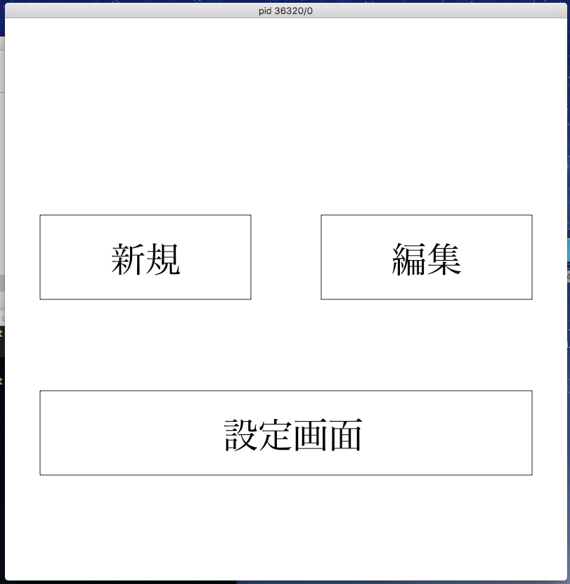
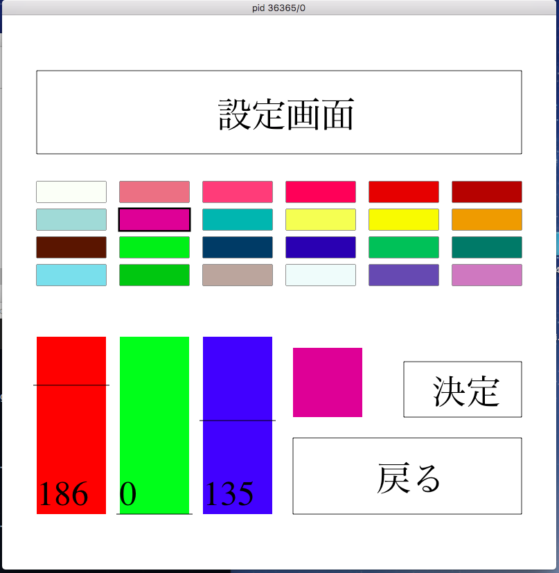
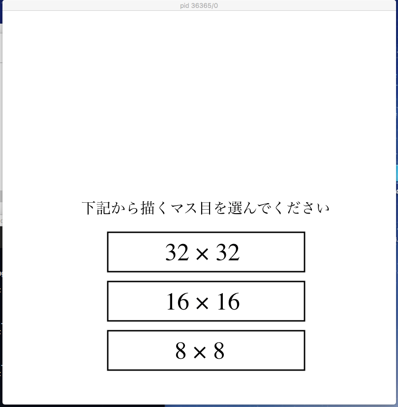
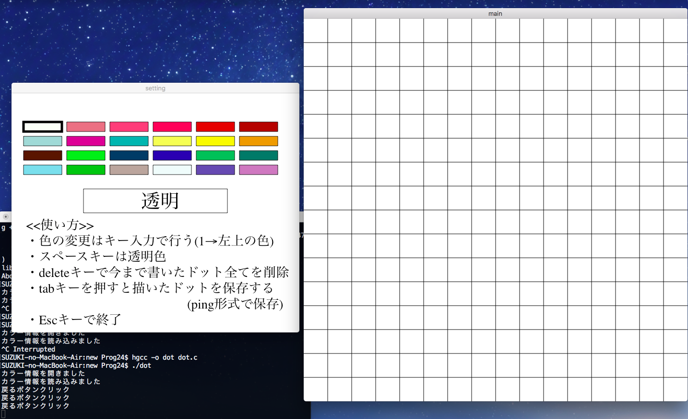

### ▷内容ファイル
```
kadai/  dot         (本体)
        color.txt   (カラー情報)
        img/        (画像保存場所)
        dats/       (再編集用ドット情報保存場所)
```
### ▷挙動
- 起動

    - 新規
        新規でドット絵の作成が開始
        <font color="red">※新規画面参照</font>
    - 編集
        当初の仕様書では１度作成したドット絵を後から編集が可能なように作る予定だった。
        しかし、時間と技術的な問題で実装できなかった。
        ドット絵の保存の際に再編集に使用予定のファイルの生成は行うようにしたが、生成されたファイルを使用して再編集を実装しようとすると、ドット絵作成部分のプログラムを全て作り直す必要があると思ったので今回の実装は諦めた。
    - 設定画面
        ドット絵を描く際に使用する色の設定。
        <font color="red">※設定画面参照</font>
- 設定画面

    カラーピッカーをイメージして作成
    - カラーボタン
        中央に並ぶ色のついたボックス
        それぞれボタンになっている
        クリックすると、その色のR,G,Bが左下のバーに反映され、編集可能になる
    - カラーバー
        左下にある赤、緑、青の縦長のバー
        マウスのドラッグ操作で0~255までの値が選択可能
        ここの値を変更するとカラーバー横に編集後の色がリアルタイムに表示される
    - 決定
        このボタンを押すと選択中の色の変更を確定する
        これを押さずに他の色を選択すると編集は無効になる
    - 戻る
        起動時の画面に戻る
- 新規作成(マス目選択)

    新規でドット絵を描く際の一辺のマス目数の選択
- 新規作成(エディタ)

    - 左画面(カラーウィンドウ)
        使用する色の選択を行う
        操作方法はキー操作
        左上の色を選択するときは、キーの'1'を押す
        右下の色を選択するときは、キーの'n'を押す
